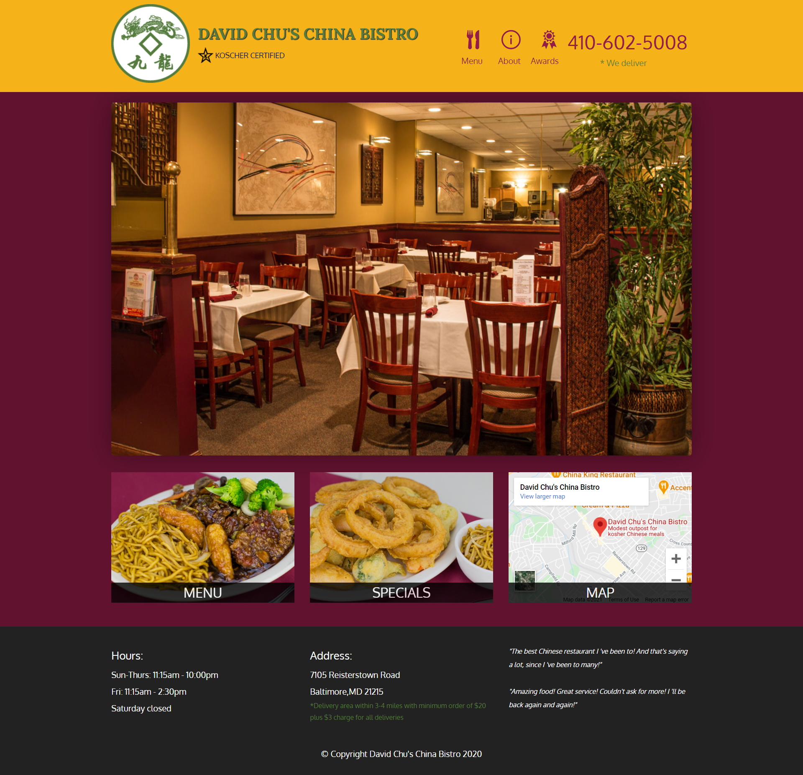
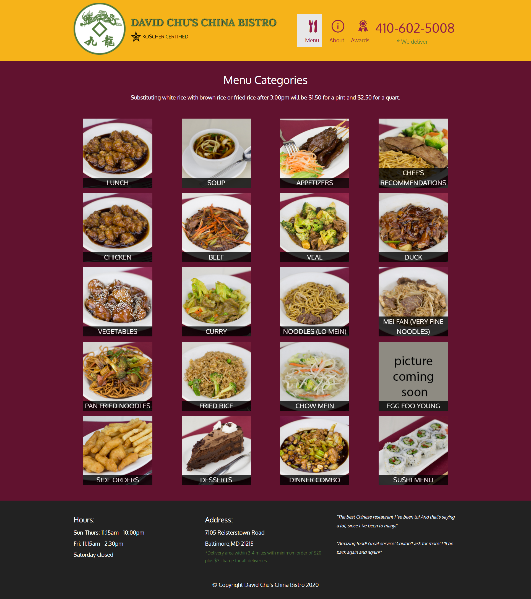
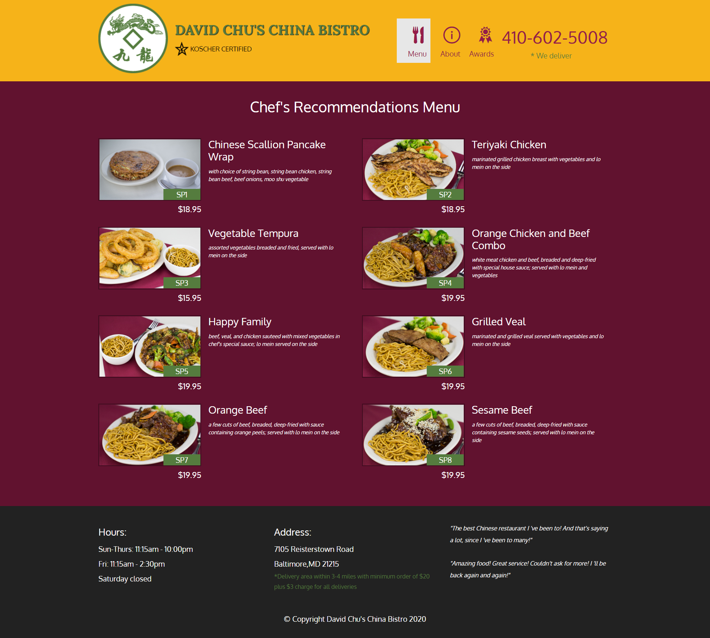

<h1 align="center">Restaurant Site</h1>

__This is a sample site for restaurant. It includes the menu,location,photos of the dishes and even the prices.__
## Table of contents 
* <a href="#pages">Pages </a>
* <a href="#screenshots">Screenshots </a>
* <a href="#tech-and-framework-used">Tech and framework used </a>
* <a href="#link-to-the-project ">Link to the project  </a>
## Pages
 
## Screenshots
* 1200px and above

 

 
 

* 768px-1199px
* 576px-767px
* 575px and below

## Tech and framework used
* HTML
* CSS
* JavaScript
* Bootstrap
* Ajax

## Link to the project 

https://animeshsingh75.github.io/project/

