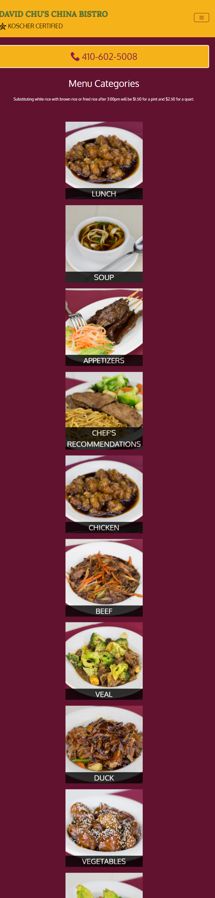

<h1 align="center">Restaurant Site</h1>

<b>This is a sample site for restaurant. It includes the menu,location,photos of the dishes and even the prices.All images present in the menupages and single menu are dynamically loaded using ajax and even the price and description are fetched from a json file deployed on heroku.Also a simple loader is present on the website
    </b>

<h2 align="center">Table of contents </h2>

* <a href="#pages">Pages </a>
* <a href="#tech-and-framework-used">Tech and framework used </a>
* <a href="#link-to-the-project ">Link to the project  </a>
* <a href="#screenshots">Screenshots </a>

## Pages
There are 3 pages in the website-:
* Home
* Menu
* Single Menu Category 
 ## Tech and framework used
* HTML
* CSS
* JavaScript
* Bootstrap
* Ajax

## Link to the project 

https://animeshsingh75.github.io/project/

## Screenshots
* 1200px and above

 

* 768px-1199px

 

* 576px-767px

 

 
* 575px and below

 

